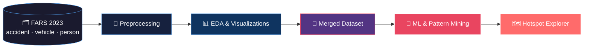

<div align="center">

# 🚗 Mining Crash Patterns

**Turning fatal crash data into actionable insight — from raw CSVs to ML models and live maps.**

[](https://www.python.org/)
[](https://jupyter.org/)
[](https://streamlit.io/)
[](https://scikit-learn.org/)
[](https://www.nhtsa.gov/research-data/fatality-analysis-reporting-system-fars)

[Repository](https://github.com/MiningCrashPatterns/data-preprocessing-and-analysis) · [FARS Data](https://www.nhtsa.gov/research-data/fatality-analysis-reporting-system-fars) · [Run the App](#-crash-hotspot-explorer)

</div>

---

## What is this?

Every year, the U.S. records tens of thousands of fatal motor-vehicle crashes. Buried inside [NHTSA's Fatality Analysis Reporting System (FARS)](https://www.nhtsa.gov/research-data/fatality-analysis-reporting-system-fars) are patterns — when crashes happen, where they cluster, who is most at risk, and which conditions make outcomes worse.

This repository is a full **data-mining pipeline** for that question:

> **Raw crash records → clean tables → merged dataset → statistical insight → machine learning → interactive hotspot maps**

We work across three linked FARS tables — **accidents**, **vehicles**, and **persons** — and push the results into notebooks, models, and a Streamlit app you can actually explore.

---

## Pipeline at a glance



---

## Highlights

<table>
<tr>
<td width="50%">

### 🔬 Deep analysis
Temporal heatmaps, weather × lighting cross-tabs, rural/urban splits, multi-fatal rate breakdowns, and injury severity profiling across the full FARS schema.

</td>
<td width="50%">

### 🤖 Machine learning
Crash severity prediction, driver injury modeling, manufacturer safety comparison, SHAP explainability, association rule mining, and crash archetype clustering.

</td>
</tr>
<tr>
<td width="50%">

### 🗺️ Live exploration
A **Colorado Crash Hotspot Explorer** built with Streamlit — filter by year, season, time of day, and overlay density heatmaps or DBSCAN danger zones.

</td>
<td width="50%">

### 📄 Full documentation
Proposal and checkpoint reports with presentation slides — the full story from research question to results.

</td>
</tr>
</table>

---

## Repository map

```
data-preprocessing-and-analysis/
│
├── 📁 accident/                  Accident table prep + national EDA
├── 📁 vehicle/                   Vehicle table cleaning
├── 📁 person/                    Person table prep + injury analysis
├── 📁 merged/                    Unified accident–vehicle–person analysis
├── 📁 Models-Analysis/           ML notebooks & pattern discovery
├── 📁 crash-hotspot-detection/   Streamlit app + Colorado dataset
└── 📁 slides-and-reports/        Proposal & checkpoint PDFs
```

<details>
<summary><strong>📓 All notebooks (click to expand)</strong></summary>

<br>

| Directory | Notebook | What it does |
|-----------|----------|--------------|
| `accident/` | `AccidentCsvPreparation.ipynb` | Load, clean, and export the accident table |
| `accident/` | `dataanalysisAccident.ipynb` | FARS 2023 EDA — time, geography, weather, severity |
| `vehicle/` | `VehicleCsvPrepraration.ipynb` | Vehicle table cleaning and preparation |
| `person/` | `PersonCsvPrep-Analysis.ipynb` | Person roles, injury severity, and cleanup |
| `merged/` | `FinalMergedDFAnalysis.ipynb` | Analysis on the fully merged dataset |
| `Models-Analysis/` | `Crash_Severity_Prediction_and_High_Risk_Pattern_Discovery.ipynb` | Severity ML, SHAP, association rules, archetypes |
| `Models-Analysis/` | `Understanding_Severe_Injury_Risk_Factors_in_US_Crashes.ipynb` | Severe injury risk factor analysis |
| `Models-Analysis/` | `driver_injury_severity_modeling.ipynb` | Driver injury severity models |
| `Models-Analysis/` | `Manufacturer_Safety_Risk_Model.ipynb` | Manufacturer safety risk scoring |
| `Models-Analysis/` | `Manufacturer_Safety_comparision.ipynb` | Cross-manufacturer safety comparison |

</details>

---

## Quick start

### 1 · Clone and set up Python

```bash
git clone https://github.com/MiningCrashPatterns/data-preprocessing-and-analysis.git
cd data-preprocessing-and-analysis
pip install pandas numpy matplotlib seaborn scikit-learn plotly jupyter
```

> Modeling notebooks may pull in additional libraries (SHAP, XGBoost, etc.) — check each notebook's imports and install as needed.

### 2 · Download FARS data

Grab the **[FARS 2023 National CSV](https://www.nhtsa.gov/research-data/fatality-analysis-reporting-system-fars)** bundle and place the three core files here:

```
FARS2023NationalCSV/FARS2023NationalCSV/FARS2023NationalCSV/
├── accident.csv
├── vehicle.csv
└── person.csv
```

Update path variables inside each notebook if your folder layout differs. Many notebooks were originally run in **Google Colab** with Google Drive paths — swap those for local paths before running.

### 3 · Run the pipeline

```
accident/ + vehicle/ + person/  →  merged/  →  Models-Analysis/
```

Run the prep notebooks first (they often write parquet intermediates), then merge, then model.

---

## 🗺️ Crash Hotspot Explorer

The fastest way to see the project in action — no FARS download required.

```bash
cd crash-hotspot-detection
pip install -r requirements.txt
streamlit run app.py
```

Then open **http://localhost:8501** in your browser.

| View | Description |
|------|-------------|
| **Crash Heatmap** | Filterable Plotly density map with live crash & fatality metrics |
| **Crash Hotspots** | DBSCAN spatial clustering — zones color-coded by fatality count |

**Dataset:** `Colorado_Data_2015_2023_Cleaned.csv` (included in repo)

**Stack:** Streamlit · Pandas · Plotly · scikit-learn

---

## Tech stack

| Layer | Tools |
|-------|-------|
| Data | [FARS / NHTSA](https://www.nhtsa.gov/research-data/fatality-analysis-reporting-system-fars), Pandas, Parquet |
| Analysis | Jupyter, Matplotlib, Seaborn, NumPy |
| Modeling | scikit-learn, SHAP, association rule mining, clustering |
| App | Streamlit, Plotly, DBSCAN |
| Environment | Python 3.10+ · Colab-compatible notebooks |

---

## Documentation

Formal write-ups live in [`slides-and-reports/`](slides-and-reports/):

| Document | File |
|----------|------|
| Project Proposal | `DataMining_Project_Proposal_Report.pdf` |
| Proposal Slides | `DataMining_Project_Proposal_Presentation.pdf` |
| Checkpoint Report | `DataMining_Project_Checkpoint_Report.pdf` |
| Checkpoint Slides | `DataMining_Project_Checkpoint_Presentation.pdf` |

---

## Good to know

- **Large data files are not in the repo.** Download FARS CSVs from NHTSA and adjust paths locally.
- **Notebook order matters.** Prep notebooks produce parquet files that downstream notebooks consume.
- **Colab paths.** If a notebook mounts Google Drive, replace those paths before running locally.

---